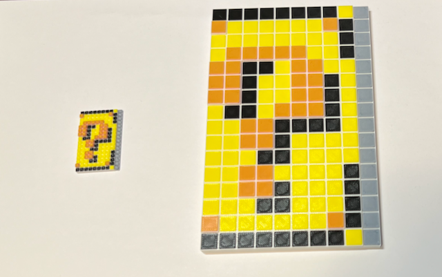
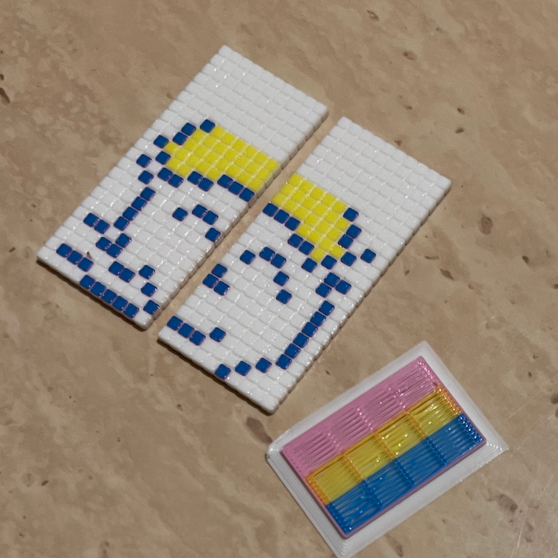
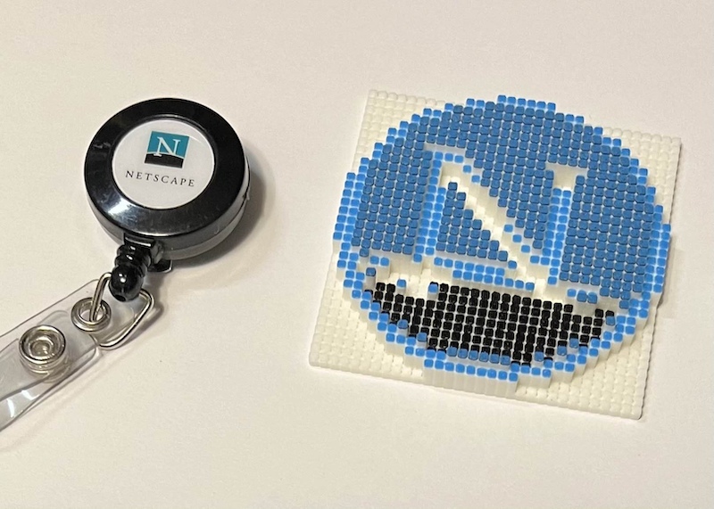
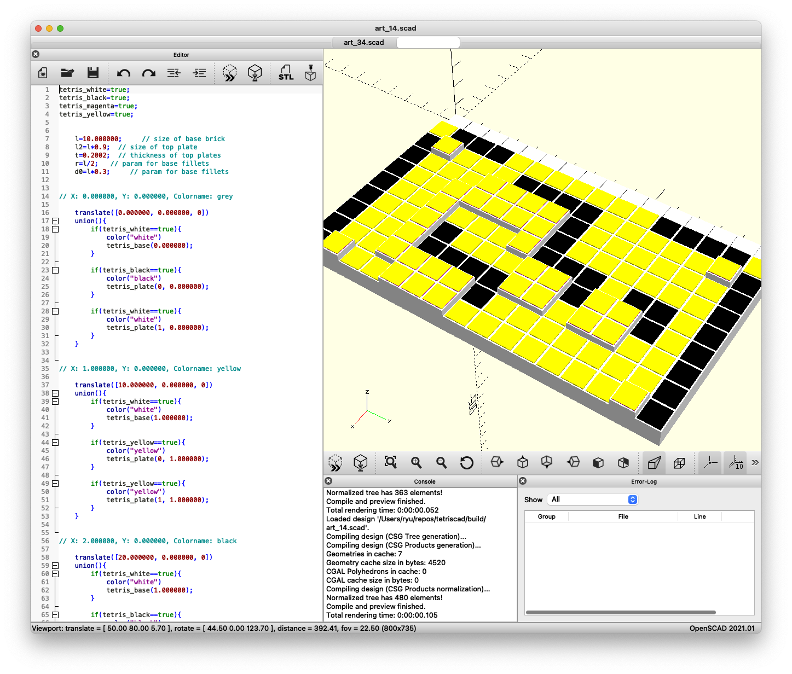
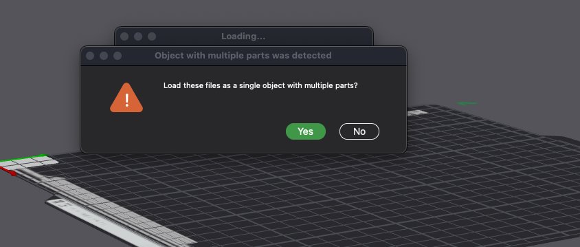
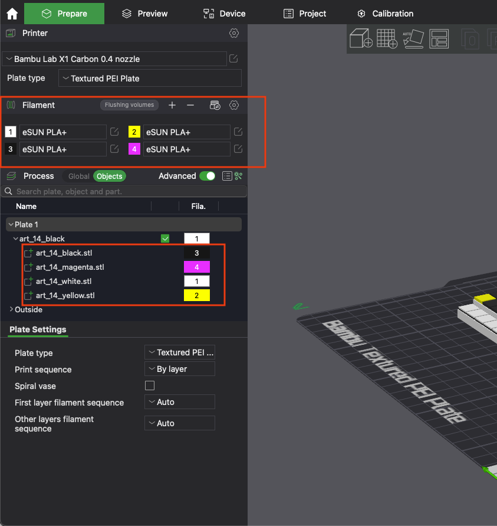

# TETRISCAD

[Tetris 学習プロジェクト](https://github.com/seigot/tetris)の Tetris Art フィールドデータをカラー 3D プリンタへ出力します。
<!-- また、PNG 画像を低解像度ピクセル化してカラー 3D プリンタへ出力します。-->


<!--  -->
<!--  -->

## Tetris 出力を 3D プリントする

@seigot 氏その他による Tetris [学習プログラムプロジェクト](https://github.com/seigot/tetris) に含まれる、Tetris Art のゲームフィールドを 3D プリントします。以下の点に注意してください。

* そのままではフィールドデータが `result.json` へ出力されないので、 `game_manager.py` を[すこしだけ改変します](./diff_game_manager)。

<!-- patch についての説明を追加する -->

### フィールドデータの作成

1.  [Tetris Art ドキュメント](https://github.com/seigot/tetris/blob/master/doc/files/art.md)に沿ってリプレイを実行します。

    例：`python start.py -l1 -m art --art_config_filepath config/art/art_config_sample14.json -d30 --BlockNumMax 600`


1. 望みの画像が完成したら Ctrl-C で実行を止めます。また、`--BlockNumMax` オプションを使って任意の世代で実行を停止できます。

1.  出力されたフィールドデータファイル `result.json` を別名で保存します。例：`cp result.json ${tetriscad_home}/result/result_14.json` 

    ※ `${tetriscad_home}` は本リポジトリディレクトリへのパス

    `Tetris Art` の完成画像は[このドキュメント](./shape_list.md)に収録されています。

### SCAD ファイルの作成

1. フィールドデータを色付き 3D ブロックで構成される CAD データに変換します。

    ```
    python3 tetris_art_scad_gen.py --result results/result_14.json --filament filament_colors/filament_colors14.json --cmdfile build/a14cmd.sh -s 10  > build/art_14.scad
    ```

    ※ `filament_colors/filament_colors*.json` はブロックの色とフィラメントデータの対応パラメータ。[このドキュメント](./shape_list.md)を参照。

1. `build/art_14.scad` を [openscad](https://openscad.org/) で開いて確認します。


### STL ファイル生成

1. 単色フィラメント用 STL ファイルを生成します。

    ```
    cd build
    chmod +x a14cmd.sh
    ./a14cmd.sh art_14
    ```

1.  以下のファイルが `build/art_14` 下に生成されます。

    ```
    art_14_black.stl
    art_14_magenta.stl
    art_14_white.stl
    art_14_yellow.stl
    ```

### カラー 3D プリント

1. 前節で生成した複数の STL ファイルを混成してカラー 3D プリンタでプリントします。
<br> <br> Bambu A1 シリーズの場合は以下の手順でプリントします。

    1. 生成された stl ファイルを Finder ないしファイルエクスプローラで複数選択します。
    1. 選択したファイルを Bambu Studio の Prepare タブへドロップします。
    1. "Load these files as a single object with multiple parts?" と尋ねられるので "Yes" を選択します。
    1. カラーフィラメントフィーダーにフィラメントをセットし、Bambu Studio の Filament 領域で正しい色が設定されていることを確認します。必要に応じて手動で設定します。
    2. Process > Objects を選択し、stl ファイルのツリーを展開して各 stl ファイルにフィラメントを割り当てます。ファイル名に合わせてフィラメント色を選択します。
    1. その他の設定が終わったら Slice plate、Print plate の順に進めます。





数十分〜数時間でプリントが完了します。このリポジトリのプログラムはフィラメント交換回数が抑えられるように色設定が制限されています。
    
<!--
#### コマンド（プログラム）

* `tetris_art_scad_gen.py`
* `art_*.cmd`

-->

<!--
#### 実行例

`1:onigiri`         高さ 13
`4:heart`           高さ 16
`5:hamburger_shop`  高さ 15
`10:python_logo`    高さ 16
`12:neko`           高さ 16

`14:question_block` 高さ 16 * 2.5 = 40mm 

```
python3 tetris_art_scad_gen.py --result results/result_14.json --filament filament_colors/filament_colors14.json --cmdfile build/a14.cmd -s 2.5  > build/art_14.scad
```

おおきいやつ

```
python3 tetris_art_scad_gen.py --result results/result_14.json --filament filament_colors/filament_colors14.json --cmdfile build/a14.cmd -s 10  > build/art_14.scad  
```

`15:coin`           高さ 16

```
python3 tetris_art_scad_gen.py --result results/result_14.json --filament filament_colors/filament_colors14.json --cmdfile build/a14.cmd -s 2.5  > build/art_14.scad
```

`16:clefairy`       高さ 16
`17:jigglypuff`     高さ 16
`18:docker`         高さ 16
`19:tux`            高さ 16
`20:droid`          高さ 16
`21:jenkins`        高さ 16
`22:firefox`        高さ 14
`23:gopher`         高さ 16
`24:goomba`         高さ 16
`25:toad`           高さ 16
`26:super_star`     高さ 16
`27:fire_flower`    高さ 16
`30:puyo_green`     高さ 16
`31:puyo_red`       高さ 16
`32:puyo_yellow`    高さ 16
`33:puyo_blue`      高さ 16
`34:tweet`          高さ 14
`35:art`            高さ 14
`36:toypoodle`      高さ 14
`37:pome`           高さ 16

`38:karaage-san(r)`
`39:karaage-san(l)`
`40:nekojistar-san(l)`
`41:nekojistar-san(r)`

--> 
<!--
## PNG 画像を 3D プリントする

### 実装メモ
* 任意の png 画像を入力
* 変換後の縦横ピクセル数を指定
* 解像度減、blur などする
* 24ビット色情報をプリント可能な色名（~16 色）へ変換する（外部設定ファイルで変更可）
* 色と高さの対応づけ（外部設定ファイルで調整可）
* 色名を2色の組み合わせ（上下レイヤーの別あり）に変換する

#### コマンド（プログラム）

* `colorscan/getcolor.py`
* `art_scad_gen.py`
* `build_netscape.sh`

### その他メモ (できれば)

* `tetris_art_scad_gen.py` と `art_scad_gen.py` を統合

-->

