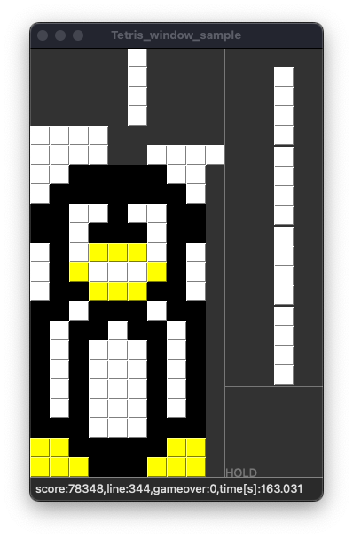

# Shape-list 内の色名定義

tetris リポジトリの Tetris Art 出力データは 24 ビットカラーで色指定される。これは Tetris Art のコンフィギュレーションに記述されている。

## 色名定義の例と読み方

Tetris Art リプレイのコンフィギュレーションファイルで以下の色情報が定義される。

`config/art/art_config_sample1.json`

```
  "color": {
    "shapeI": "0xfffaf0",
    "shapeL": "0xfffaf0",
    "shapeJ": "0xfffaf0",
    "shapeT": "0xfffaf0",
    "shapeO": "0x000000",
    "shapeS": "0x000000",
    "shapeZ": "0xfffaf0"
  }
```

いっぽう `result.json` には英語の色名とフィールド各タイルのインデックス番号（0-7）が出力される。どの作例でも同一内容。

```
"shape_info": {
  "shapeNone": {"index": 0, "color": "none"}, 
  "shapeI": {"index": 1, "color": "red"}, 
  "shapeL": {"index": 2, "color": "green"}, 
  "shapeJ": {"index": 3, "color": "purple"}, 
  "shapeT": {"index": 4, "color": "gold"}, 
  "shapeO": {"index": 5, "color": "pink"}, 
  "shapeS": {"index": 6, "color": "blue"}, 
  "shapeZ": {"index": 7, "color": "yellow"}
},
```

これら 2 つの key-value をマップすればタイルのインデックス番号と24ビットカラー値が対応付けられる。なお、`result.json` の英語の色名はテトリミノのデフォルト配色であって Tetris Art では使われない。

任意の Tetris Art について、使用される 24 ビットカラー値と盤面結果画像の色合いを参考にして 3D プリントで出力する色を決める。出力色はフィラメントの選択と色の重ね方に依存するため、汎用的な計算式を求める努力はしない。プリンタに載せるフィラメント色の組み合わせの都合がいいように手動で選ぶ。

各タイルのフィラメント出力用パラメータとして層 0 (下) の色、層 1 (上) の色、3Dプリント盤面 z 方向深さ（印刷面の高さ）、の 3 つの値を指定する。また印刷する盤面の y 方向の全長（下端からの長さ）を指定する。全長を制限することでリプレイの終盤で 'I' テトリミノが繰り返し降ってくるエリアを印刷しないようにする。

## Tetris Art Samples の結果画像と色指定

### `1:onigiri`

`python start.py -l1 -m art --art_config_filepath config/art/art_config_sample1.json -d10`

```
  "color": {
    "shapeI": "0xfffaf0",
    "shapeL": "0xfffaf0",
    "shapeJ": "0xfffaf0",
    "shapeT": "0xfffaf0",
    "shapeO": "0x000000",
    "shapeS": "0x000000",
    "shapeZ": "0xfffaf0"
  }
```


手動作成したフィラメント色指定：

```
{
  "color_info": [
    {"index": 0, "color": "lightgray"},
    {"index": 1, "color": "white"},
    {"index": 2, "color": "white"},
    {"index": 3, "color": "white"},
    {"index": 4, "color": "white"},
    {"index": 5, "color": "black"},
    {"index": 6, "color": "black"},
    {"index": 7, "color": "white"}
  ],
  "filament_info": {
    "white": {"color": ["white", "white"], "depth": 1},
    "lgrey": {"color": ["black", "white"], "depth": 0},
    "black": {"color": ["black", "black"], "depth": 2}
  },
  "height_limit": 13
}
```

### `2:manji`

`python start.py -l1 -m art --art_config_filepath config/art/art_config_sample2.json -d10`

```
  "color": {
    "shapeI": "0xff1943",
    "shapeL": "0xf5f5f5",
    "shapeJ": "0xf5f5f5",
    "shapeT": "0xf5f5f5",
    "shapeO": "0xf5f5f5",
    "shapeS": "0xf5f5f5",
    "shapeZ": "0xf5f5f5"
  }
```


手動作成したフィラメント色指定：

```
{
  "color_info": [
    {"index": 0, "color": "white"},
    {"index": 1, "color": "red"},
    {"index": 2, "color": "white"},
    {"index": 3, "color": "white"},
    {"index": 4, "color": "white"},
    {"index": 5, "color": "white"},
    {"index": 6, "color": "white"},
    {"index": 7, "color": "white"}
  ],
  "filament_info": {
    "white": {"color": ["white", "white"], "depth": 0},
    "red": {"color": ["yellow", "magenta"], "depth": 1}
  },
  "height_limit": 15
}
```

### `3:cartoon charactor`

`python start.py -l1 -m art --art_config_filepath config/art/art_config_sample3.json -d10`

  ```
  "color": {
    "shapeI": "0xf0f8ff",
    "shapeL": "0x000000",
    "shapeJ": "0x000000",
    "shapeT": "0x000000",
    "shapeO": "0x191970",
    "shapeS": "0x000000",
    "shapeZ": "0x000000"
  }
  ```


手動作成したフィラメント色指定：

```
{
  "color_info": [
    {"index": 0, "color": "white"},
    {"index": 1, "color": "white"},
    {"index": 2, "color": "white"},
    {"index": 3, "color": "white"},
    {"index": 4, "color": "white"},
    {"index": 5, "color": "blue"},
    {"index": 6, "color": "white"},
    {"index": 7, "color": "white"}
  ],
  "filament_info": {
    "white": {"color": ["white", "white"], "depth": 0},
    "blue": {"color": ["magenta", "cyan"], "depth": 1}
  },
  "height_limit": 15
}
```

### `4:heart`

`python start.py -l1 -m art --art_config_filepath config/art/art_config_sample4.json -d4  --BlockNumMax 50`

```
  "color": {
    "shapeI": "0xf5f5f5",
    "shapeL": "0xf5f5f5",
    "shapeJ": "0xf5f5f5",
    "shapeT": "0xff69b4",
    "shapeO": "0xf5f5f5",
    "shapeS": "0xff69b4",
    "shapeZ": "0xff69b4"
  }
```


手動作成したフィラメント色指定：

```
{
  "color_info": [
    {"index": 0, "color": "white"},
    {"index": 1, "color": "white"},
    {"index": 2, "color": "white"},
    {"index": 3, "color": "white"},
    {"index": 4, "color": "pink"},
    {"index": 5, "color": "white"},
    {"index": 6, "color": "pink"},
    {"index": 7, "color": "pink"}
  ],
  "filament_info": {
    "white": {"color": ["white", "white"], "depth": 0},
    "pink": {"color": ["magenta", "white"], "depth": 1}
  },
  "height_limit": 16
}
```

### `5:hamburger_shop`

`config/art/art_config_sample5.json`

```
  "color": {
    "shapeI": "0xf5f5f5",
    "shapeL": "0xffff00",
    "shapeJ": "0xffff00",
    "shapeT": "0xf5f5f5",
    "shapeO": "0xffff00",
    "shapeS": "0xff1943",
    "shapeZ": "0xff1943"
  }
```


手動作成したフィラメント色指定：

```
{
  "color_info": [
    {"index": 0, "color": "white"},
    {"index": 1, "color": "yellow"},
    {"index": 2, "color": "yellow"},
    {"index": 3, "color": "white"},
    {"index": 4, "color": "yellow"},
    {"index": 5, "color": "white"},
    {"index": 6, "color": "white"},
    {"index": 7, "color": "white"}
  ],
  "filament_info": {
    "white": {"color": ["white", "white"], "depth": 0},
    "yellow": {"color": ["yellow", "yellow"], "depth": 1}
  },
  "height_limit": 15
}
```

### `6:parking`

`config/art/art_config_sample6.json`

```
  "color": {
    "shapeI": "0xf5f5f5",
    "shapeL": "0x0000ff",
    "shapeJ": "0x0000ff",
    "shapeT": "0x0000ff",
    "shapeO": "0x0000ff",
    "shapeS": "0xff1943",
    "shapeZ": "0xff1943"
  }
```


手動作成したフィラメント色指定：

```
{
  "color_info": [
    {"index": 0, "color": "white"},
    {"index": 1, "color": "white"},
    {"index": 2, "color": "blue"},
    {"index": 3, "color": "blue"},
    {"index": 4, "color": "blue"},
    {"index": 5, "color": "blue"},
    {"index": 6, "color": "white"},
    {"index": 7, "color": "white"}
  ],
  "filament_info": {
    "white": {"color": ["white", "white"], "depth": 0},
    "blue": {"color": ["magenta", "cyan"], "depth": 1}
  },
  "height_limit": 16
}
```

### `7:team`

`--art_config_filepath`

```
  "color": {
    "shapeI": "0xf5f5f5",
    "shapeL": "0x0000ff",
    "shapeJ": "0x0000ff",
    "shapeT": "0xc71585",
    "shapeO": "0xc71585",
    "shapeS": "0xc71585",
    "shapeZ": "0xf5f5f5"
  }
```


手動作成したフィラメント色指定：

```
{
  "color_info": [
    {"index": 0, "color": "white"},
    {"index": 1, "color": "white"},
    {"index": 2, "color": "white"},
    {"index": 3, "color": "white"},
    {"index": 4, "color": "magenta"},
    {"index": 5, "color": "magenta"},
    {"index": 6, "color": "magenta"},
    {"index": 7, "color": "white"}
  ],
  "filament_info": {
    "white": {"color": ["white", "white"], "depth": 0},
    "cyan": {"color": ["magenta", "magenta"], "depth": 1}
  },
  "height_limit": 16
}
```

### `8:happy_new_year_2023`

`config/art/art_config_sample8.json`

```
  "color": {
    "shapeI": "0x0000ff",
    "shapeL": "0x0000ff",
    "shapeJ": "0x0000ff",
    "shapeT": "0xf5f5f5",
    "shapeO": "0x0000ff",
    "shapeS": "0xff1943",
    "shapeZ": "0xff1943"
  }
```


手動作成したフィラメント色指定：

```
{
  "color_info": [
    {"index": 0, "color": "white"},
    {"index": 1, "color": "blue"},
    {"index": 2, "color": "blue"},
    {"index": 3, "color": "blue"},
    {"index": 4, "color": "white"},
    {"index": 5, "color": "blue"},
    {"index": 6, "color": "white"},
    {"index": 7, "color": "white"}
  ],
  "filament_info": {
    "white": {"color": ["white", "white"], "depth": 0},
    "blue": {"color": ["magenta", "cyan"], "depth": 1}
  },
  "height_limit": 14
}
```

### `9:taka`

`config/art/art_config_sample9.json`

```
  "color": {
    "shapeI": "0x0000ff",
    "shapeL": "0x0000ff",
    "shapeJ": "0x0000ff",
    "shapeT": "0xf5f5f5",
    "shapeO": "0x0000ff",
    "shapeS": "0xff1943",
    "shapeZ": "0xff1943"
  }
```


手動作成したフィラメント色指定：

```
{
  "color_info": [
    {"index": 0, "color": "white"},
    {"index": 1, "color": "blue"},
    {"index": 2, "color": "blue"},
    {"index": 3, "color": "blue"},
    {"index": 4, "color": "white"},
    {"index": 5, "color": "blue"},
    {"index": 6, "color": "white"},
    {"index": 7, "color": "white"}
  ],
  "filament_info": {
    "white": {"color": ["white", "white"], "depth": 0},
    "blue": {"color": ["magenta", "cyan"], "depth": 1}
  },
  "height_limit": 14
}
```

### `10:python_logo`

607 回

`python start.py -l1 -m art --art_config_filepath config/art/art_config_sample10.json -d100 --BlockNumMax 607`

```
  "color": {
    "shapeI": "0xf5f5f5",
    "shapeL": "0x0000cd",
    "shapeJ": "0xffff00",
    "shapeT": "0xf5f5f5",
    "shapeO": "0x000000",
    "shapeS": "0x000000",
    "shapeZ": "0x000000"
  }
```


手動作成したフィラメント色指定：

```
{
  "color_info": [
    {"index": 0, "color": "white"},
    {"index": 1, "color": "white"},
    {"index": 2, "color": "blue"},
    {"index": 3, "color": "yellow"},
    {"index": 4, "color": "white"},
    {"index": 5, "color": "white"},
    {"index": 6, "color": "white"},
    {"index": 7, "color": "white"}
  ],
  "filament_info": {
    "white": {"color": ["white", "white"], "depth": 0},
    "yellow": {"color": ["yellow", "yellow"], "depth": 1},
    "blue": {"color": ["black", "cyan"], "depth": 1}
  },
  "height_limit": 16
}
```

### `11:yoshi`

607 回

python start.py -l1 -m art --art_config_filepath config/art/art_config_sample11.json -d100 --BlockNumMax 607

```
  "color": {
    "shapeI": "0xf5f5f5",
    "shapeL": "0x000000",
    "shapeJ": "0x000000",
    "shapeT": "0xf5f5f5",
    "shapeO": "0x000000",
    "shapeS": "0x000000",
    "shapeZ": "0x000000"
  }
```


手動作成したフィラメント色指定：

```
{
  "color_info": [
    {"index": 0, "color": "white"},
    {"index": 1, "color": "white"},
    {"index": 2, "color": "black"},
    {"index": 3, "color": "black"},
    {"index": 4, "color": "white"},
    {"index": 5, "color": "black"},
    {"index": 6, "color": "black"},
    {"index": 7, "color": "black"}
  ],
  "filament_info": {
    "white": {"color": ["white", "white"], "depth": 0},
    "black": {"color": ["black", "black"], "depth": 1}
  },
  "height_limit": 16
}
```

### `12:neko`

700 回

`start.py -l1 -m art --art_config_filepath config/art/art_config_sample12.json -d100 --BlockNumMax 700`

```
  "color": {
    "shapeI": "0x2e8b57",
    "shapeL": "0x000000",
    "shapeJ": "0x696969",
    "shapeT": "0xf5f5f5",
    "shapeO": "0xff0000",
    "shapeS": "0xff0000",
    "shapeZ": "0xffff00"
  }
```


手動作成したフィラメント色指定：

```
{
  "color_info": [
    {"index": 0, "color": "white"},
    {"index": 1, "color": "grey"},
    {"index": 2, "color": "black"},
    {"index": 3, "color": "grey"},
    {"index": 4, "color": "white"},
    {"index": 5, "color": "red"},
    {"index": 6, "color": "red"},
    {"index": 7, "color": "yellow"}
  ],
  "filament_info": {
    "white": {"color": ["white", "white"], "depth": 0},
    "black": {"color": ["black", "black"], "depth": 2},
    "grey":  {"color": ["black", "white"], "depth": 1},
    "red":   {"color": ["yellow", "magenta"], "depth": 0},
    "yellow":{"color": ["yellow", "yellow"], "depth": 1}
  },
  "height_limit": 16
}
```

### `13:kyubei`

`config/art/art_config_sample13.json`

**このファイル存在しない**

### `14:question_block`

600 回

`python start.py -l1 -m art --art_config_filepath config/art/art_config_sample14.json -d100 --BlockNumMax 600`

```
  "color": {
    "shapeI": "0xffffff",
    "shapeL": "0x000000",
    "shapeJ": "0xb8860b",
    "shapeT": "0xb8860b",
    "shapeO": "0xff0000",
    "shapeS": "0x000000",
    "shapeZ": "0xffd700"
  }
```


手動作成したフィラメント色指定：

```
{
  "color_info": [
    {"index": 0, "color": "grey"},
    {"index": 1, "color": "white"},
    {"index": 2, "color": "black"},
    {"index": 3, "color": "orange"},
    {"index": 4, "color": "orange"},
    {"index": 5, "color": "white"},
    {"index": 6, "color": "black"},
    {"index": 7, "color": "yellow"}
  ],
  "filament_info": {
    "white": {"color": ["white", "white"], "depth": 0},
    "black": {"color": ["black", "black"], "depth": 1},
    "grey":  {"color": ["black", "white"], "depth": 0},
    "orange":   {"color": ["magenta", "yellow"], "depth": 2},
    "yellow": {"color": ["yellow", "yellow"], "depth": 1}
  },
  "height_limit": 16
}
```

### `15:coin`

700 回

`python start.py -l1 -m art --art_config_filepath config/art/art_config_sample15.json -d100 --BlockNumMax 700`

```
  "color": {
    "shapeI": "0xffffff",
    "shapeL": "0xffd700",
    "shapeJ": "0xb8860b",
    "shapeT": "0x000000",
    "shapeO": "0xff0000",
    "shapeS": "0xf5f5f5",
    "shapeZ": "0xf5f5f5"
  }
```


手動作成したフィラメント色指定：

```
{
  "color_info": [
    {"index": 0, "color": "grey"},
    {"index": 1, "color": "white"},
    {"index": 2, "color": "yellow"},
    {"index": 3, "color": "orange"},
    {"index": 4, "color": "black"},
    {"index": 5, "color": "white"},
    {"index": 6, "color": "white"},
    {"index": 7, "color": "white"}
  ],
  "filament_info": {
    "white": {"color": ["white", "white"], "depth": 0},
    "black": {"color": ["black", "black"], "depth": 1},
    "grey":  {"color": ["black", "white"], "depth": 0},
    "orange":   {"color": ["magenta", "yellow"], "depth": 2},
    "yellow": {"color": ["yellow", "yellow"], "depth": 1}
  },
  "height_limit": 16
}
```

### `16:clefairy`

700 回

`python start.py -l1 -m art --art_config_filepath config/art/art_config_sample16.json -d100 --BlockNumMax 700`

```
  "color": {
    "shapeI": "0xffffff",
    "shapeL": "0x000000",
    "shapeJ": "0x000000",
    "shapeT": "0xffc0cb",
    "shapeO": "0xff0000",
    "shapeS": "0xf5f5f5",
    "shapeZ": "0xff69b4"
  }
```


手動作成したフィラメント色指定：

```
{
  "color_info": [
    {"index": 0, "color": "white"},
    {"index": 1, "color": "white"},
    {"index": 2, "color": "black"},
    {"index": 3, "color": "black"},
    {"index": 4, "color": "pink"},
    {"index": 5, "color": "white"},
    {"index": 6, "color": "white"},
    {"index": 7, "color": "magenta"}
  ],
  "filament_info": {
    "white": {"color": ["white", "white"], "depth": 0},
    "black": {"color": ["black", "black"], "depth": 2},
    "pink":  {"color": ["magenta", "white"], "depth": 1},
    "magenta":{"color": ["magenta", "magenta"], "depth": 1}
  },
  "height_limit": 16
}
```

### `17:jigglypuff`

600 回

`python start.py -l1 -m art --art_config_filepath config/art/art_config_sample17.json -d100 --BlockNumMax 600`

```
    "color": {
        "shapeI": "0xffffff",
        "shapeL": "0x000000",
        "shapeJ": "0x006400",
        "shapeT": "0xffc0cb",
        "shapeO": "0xff0000",
        "shapeS": "0xf5f5f5",
        "shapeZ": "0xff69b4"
  }
```


手動作成したフィラメント色指定：

```
{
  "color_info": [
    {"index": 0, "color": "white"},
    {"index": 1, "color": "white"},
    {"index": 2, "color": "black"},
    {"index": 3, "color": "green"},
    {"index": 4, "color": "pink"},
    {"index": 5, "color": "magenta"},
    {"index": 6, "color": "white"},
    {"index": 7, "color": "dpink"}
  ],
  "filament_info": {
    "white": {"color": ["white", "white"], "depth": 0},
    "black": {"color": ["black", "black"], "depth": 1},
    "green": {"color": ["black", "cyan"], "depth": 1},
    "pink":  {"color": ["magenta", "white"], "depth": 2},
    "magenta":{"color": ["magenta", "magenta"], "depth": 1}
    "dpink":{"color": ["black", "magenta"], "depth": 1}
  },
  "height_limit": 16
}
```

### `18:docker`

700 回

`python start.py -l1 -m art --art_config_filepath config/art/art_config_sample18.json -d100 --BlockNumMax 700`

```
  "color": {
    "shapeI": "0xffffff",
    "shapeL": "0xb0c4de",
    "shapeJ": "0x000000",
    "shapeT": "0xffffff",
    "shapeO": "0xff0000",
    "shapeS": "0x000080",
    "shapeZ": "0x4169e1"
  }
```


手動作成したフィラメント色指定：

```
{
  "color_info": [
    {"index": 0, "color": "white"},
    {"index": 1, "color": "white"},
    {"index": 2, "color": "blue"},
    {"index": 3, "color": "black"},
    {"index": 4, "color": "white"},
    {"index": 5, "color": "dblue"},
    {"index": 6, "color": "black"},
    {"index": 7, "color": "lblue"}
  ],
  "filament_info": {
    "white": {"color": ["white", "white"], "depth": 0},
    "black": {"color": ["black", "black"], "depth": 1},
    "blue": {"color": ["cyan", "cyan"], "depth": 2},
    "dblue":  {"color": ["black", "cyan"], "depth": 2},
    "lblue":{"color": ["cyan", "white"], "depth": 1}
  },
  "height_limit": 16
}
```

### `19:tux`

900 手（実際には 650 回）

`python start.py -l1 -m art --art_config_filepath config/art/art_config_sample19.json -d100 --BlockNumMax 900`

```
  "color": {
    "shapeI": "0xffffff",
    "shapeL": "0xffff00",
    "shapeJ": "0xffff00",
    "shapeT": "0xffffff",
    "shapeO": "0xff0000",
    "shapeS": "0x000000",
    "shapeZ": "0x000000"
  }
```



手動作成したフィラメント色指定：

```
{
  "color_info": [
    {"index": 0, "color": "white"},
    {"index": 1, "color": "white"},
    {"index": 2, "color": "yellow"},
    {"index": 3, "color": "yellow"},
    {"index": 4, "color": "white"},
    {"index": 5, "color": "white"},
    {"index": 6, "color": "black"},
    {"index": 7, "color": "black"}
  ],
  "filament_info": {
    "white": {"color": ["white", "white"], "depth": 0},
    "black": {"color": ["black", "black"], "depth": 1},
    "yellow": {"color": ["cyan", "cyan"], "depth": 2}
  },
  "height_limit": 16
}
```

### `20:droid`

900 手

`python start.py -l1 -m art --art_config_filepath config/art/art_config_sample20.json -d100 --BlockNumMax 900`

```
  "color": {
    "shapeI": "0xffffff",
    "shapeL": "0x008000",
    "shapeJ": "0x008000",
    "shapeT": "0xffffff",
    "shapeO": "0xff0000",
    "shapeS": "0x008000",
    "shapeZ": "0x008000"
  }
```


手動作成したフィラメント色指定：

```
{
  "color_info": [
    {"index": 0, "color": "white"},
    {"index": 1, "color": "white"},
    {"index": 2, "color": "green"},
    {"index": 3, "color": "green"},
    {"index": 4, "color": "white"},
    {"index": 5, "color": "white"},
    {"index": 6, "color": "green"},
    {"index": 7, "color": "green"}
  ],
  "filament_info": {
    "white": {"color": ["white", "white"], "depth": 0},
    "black": {"color": ["black", "black"], "depth":0},
    "green": {"color": ["cyan", "yellow"], "depth": 1}
  },
  "height_limit": 16
}
```

### `21:jenkins`

`python start.py -l1 -m art --art_config_filepath config/art/art_config_sample21.json -d100 --BlockNumMax 900`


```
  "color": {
    "shapeI": "0xffffff",
    "shapeL": "0x000000",
    "shapeJ": "0xff0000",
    "shapeT": "0xffffff",
    "shapeO": "0xff0000",
    "shapeS": "0xf5deb3",
    "shapeZ": "0x808080"
  }
```


手動作成したフィラメント色指定：

```
{
  "color_info": [
    {"index": 0, "color": "white"},
    {"index": 1, "color": "white"},
    {"index": 2, "color": "black"},
    {"index": 3, "color": "red"},
    {"index": 4, "color": "white"},
    {"index": 5, "color": "red"},
    {"index": 6, "color": "lgrey"},
    {"index": 7, "color": "lbrown"}
  ],
  "filament_info": {
    "white": {"color": ["white", "white"], "depth": 0},
    "black": {"color": ["black", "black"], "depth":2},
    "lgrey": {"color": ["black", "white"], "depth": 1},
    "red": {"color": ["yellow", "magenta"], "depth": 2},
    "lbrown": {"color": ["yellow", "white"], "depth": 1}
  },
  "height_limit": 16
}
```

### `22:firefox`

`python start.py -l1 -m art --art_config_filepath config/art/art_config_sample22.json -d100 --BlockNumMax 900`


```
  "color": {
    "shapeI": "0xffffff",
    "shapeL": "0xf0e68c",
    "shapeJ": "0xffa500",
    "shapeT": "0xffffff",
    "shapeO": "0xff0000",
    "shapeS": "0xff4500",
    "shapeZ": "0xff4500"
  }
```


手動作成したフィラメント色指定：

```
{
  "color_info": [
    {"index": 0, "color": "white"},
    {"index": 1, "color": "white"},
    {"index": 2, "color": "orange"},
    {"index": 3, "color": "white"},
    {"index": 4, "color": "red"},
    {"index": 5, "color": "red"},
    {"index": 6, "color": "yellow"},
    {"index": 7, "color": "yellow"}
  ],
  "filament_info": {
    "white": {"color": ["white", "white"], "depth": 0},
    "orange": {"color": ["magenta", "yellow"], "depth": 2},
    "red": {"color": ["yellow", "magenta"], "depth": 3},
    "yellow": {"color": ["yellow", "yellow"], "depth": 1}
  },
  "height_limit": 14
}
```

### `23:gopher`

`python start.py -l1 -m art --art_config_filepath config/art/art_config_sample23.json -d100 --BlockNumMax 900`


```
  "color": {
    "shapeI": "0xffffff",
    "shapeL": "0x808080",
    "shapeJ": "0x000000",
    "shapeT": "0xffffff",
    "shapeO": "0xff0000",
    "shapeS": "0x4169e1",
    "shapeZ": "0x4169e1"
  }
```


手動作成したフィラメント色指定：

```
{
  "color_info": [
    {"index": 0, "color": "white"},
    {"index": 1, "color": "white"},
    {"index": 2, "color": "grey"},
    {"index": 3, "color": "black"},
    {"index": 4, "color": "white"},
    {"index": 5, "color": "red"},
    {"index": 6, "color": "blue"},
    {"index": 7, "color": "blue"}
  ],
  "filament_info": {
    "white": {"color": ["white", "white"], "depth": 0},
    "black": {"color": ["black", "black"], "depth": 3},
    "grey": {"color": ["black", "white"], "depth": 2},
    "blue": {"color": ["yellow", "cyan"], "depth": 1}
  },
  "height_limit": 16
}
```

### `24:goomba`

`python start.py -l1 -m art --art_config_filepath config/art/art_config_sample24.json -d100 --BlockNumMax 900`


```
  "color": {
    "shapeI": "0xffffff",
    "shapeL": "0x000000",
    "shapeJ": "0xcd853f",
    "shapeT": "0xffffff",
    "shapeO": "0xff0000",
    "shapeS": "0x4169e1",
    "shapeZ": "0xffdead"
  }
```


手動作成したフィラメント色指定：

```
{
  "color_info": [
    {"index": 0, "color": "white"},
    {"index": 1, "color": "white"},
    {"index": 2, "color": "black"},
    {"index": 3, "color": "brown"},
    {"index": 4, "color": "white"},
    {"index": 5, "color": "red"},
    {"index": 6, "color": "blue"},
    {"index": 7, "color": "lyellow"}
  ],
  "filament_info": {
    "white": {"color": ["white", "white"], "depth": 0},
    "black": {"color": ["black", "black"], "depth": 3},
    "brown": {"color": ["magenta", "yellow"], "depth": 2},
    "lyellow": {"color": ["yellow", "white"], "depth": 1}
  },
  "height_limit": 16
}
```

### `25:toad`

`python start.py -l1 -m art --art_config_filepath config/art/art_config_sample25.json -d100 --BlockNumMax 900`


```
  "color": {
    "shapeI": "0xffffff",
    "shapeL": "0xff0000",
    "shapeJ": "0xffffff",
    "shapeT": "0x000000",
    "shapeO": "0xff0000",
    "shapeS": "0x00ff7f",
    "shapeZ": "0xffffff"
  }
```


手動作成したフィラメント色指定：

```
{
  "color_info": [
    {"index": 0, "color": "white"},
    {"index": 1, "color": "white"},
    {"index": 2, "color": "red"},
    {"index": 3, "color": "white"},
    {"index": 4, "color": "black"},
    {"index": 5, "color": "red"},
    {"index": 6, "color": "lgreen"},
    {"index": 7, "color": "white"}
  ],
  "filament_info": {
    "white": {"color": ["white", "white"], "depth": 0},
    "black": {"color": ["black", "black"], "depth": 2},
    "red": {"color": ["magenta", "magenta"], "depth": 1},
    "lgreen": {"color": ["cyan", "white"], "depth": 1}
  },
  "height_limit": 16
}
```

### `26:super_star`

`python start.py -l1 -m art --art_config_filepath config/art/art_config_sample26.json -d100 --BlockNumMax 900`


```
  "color": {
    "shapeI": "0xffffff",
    "shapeL": "0xffff00",
    "shapeJ": "0xffff00",
    "shapeT": "0x000000",
    "shapeO": "0xff0000",
    "shapeS": "0xc0c0c0",
    "shapeZ": "0xc0c0c0"
  }
```


手動作成したフィラメント色指定：

```
{
  "color_info": [
    {"index": 0, "color": "white"},
    {"index": 1, "color": "white"},
    {"index": 2, "color": "yellow"},
    {"index": 3, "color": "yellow"},
    {"index": 4, "color": "black"},
    {"index": 5, "color": "red"},
    {"index": 6, "color": "grey"},
    {"index": 7, "color": "grey"}
  ],
  "filament_info": {
    "grey": {"color": ["black", "white"], "depth": 0},
    "black": {"color": ["black", "black"], "depth": 2},
    "yellow": {"color": ["yellow", "yellow"], "depth": 1}
  },
  "height_limit": 16
}
```

### `27:fire_flower`

`python start.py -l1 -m art --art_config_filepath config/art/art_config_sample27.json -d100 --BlockNumMax 900`


```
  "color": {
    "shapeI": "0xffffff",
    "shapeL": "0xff8c00",
    "shapeJ": "0xb8860b",
    "shapeT": "0x000000",
    "shapeO": "0xff0000",
    "shapeS": "0xe0ffff",
    "shapeZ": "0x008000"
  }
```


手動作成したフィラメント色指定：

```
{
  "color_info": [
    {"index": 0, "color": "white"},
    {"index": 1, "color": "white"},
    {"index": 2, "color": "orange"},
    {"index": 3, "color": "brown"},
    {"index": 4, "color": "black"},
    {"index": 5, "color": "red"},
    {"index": 6, "color": "lblue"},
    {"index": 7, "color": "green"}
  ],
  "filament_info": {
    "white": {"color": ["white", "white"], "depth": 0},
    "black": {"color": ["black", "black"], "depth": 2},
    "orange": {"color": ["magenta", "yellow"], "depth": 1},
    "brown": {"color": ["black", "yellow"], "depth": 1},
    "lblue": {"color": ["white", "white"], "depth": 0},
    "green": {"color": ["white", "black"], "depth": 1}
  },
  "height_limit": 16
}
```

### `28:ie_logo`

`python start.py -l1 -m art --art_config_filepath config/art/art_config_sample28.json -d100 --BlockNumMax 795`


```
  "color": {
    "shapeI": "0xffffff",
    "shapeL": "0xffa500",
    "shapeJ": "0x00bfff",
    "shapeT": "0xfffff0",
    "shapeO": "0xff0000",
    "shapeS": "0xffff00",
    "shapeZ": "0x008000"
  }
```


手動作成したフィラメント色指定：

```
{
  "color_info": [
    {"index": 0, "color": "white"},
    {"index": 1, "color": "white"},
    {"index": 2, "color": "orange"},
    {"index": 3, "color": "lblue"},
    {"index": 4, "color": "black"},
    {"index": 5, "color": "red"},
    {"index": 6, "color": "yellow"},
    {"index": 7, "color": "green"}
  ],
  "filament_info": {
    "white": {"color": ["white", "white"], "depth": 0},
    "orange": {"color": ["magenta", "yellow"], "depth": 2},
    "lblue": {"color": ["white", "cyan"], "depth": 1},
    "yellow": {"color": ["yellow", "yellow"], "depth": 2}
  },
  "height_limit": 16
}
```

### `29:edge_logo`

`python start.py -l1 -m art --art_config_filepath config/art/art_config_sample29.json -d100 --BlockNumMax 625`


```
  "color": {
    "shapeI": "0xffffff",
    "shapeL": "0x00ffff",
    "shapeJ": "0x0000ff",
    "shapeT": "0xfffff0",
    "shapeO": "0xff0000",
    "shapeS": "0x32cd32",
    "shapeZ": "0x1e90ff"
  }
```


手動作成したフィラメント色指定：

```
{
  "color_info": [
    {"index": 0, "color": "white"},
    {"index": 1, "color": "white"},
    {"index": 2, "color": "lblue"},
    {"index": 3, "color": "dblue"},
    {"index": 4, "color": "white"},
    {"index": 5, "color": "red"},
    {"index": 6, "color": "green"},
    {"index": 7, "color": "blue"}
  ],
  "filament_info": {
    "white": {"color": ["white", "white"], "depth": 0},
    "blue": {"color": ["magenta", "cyan"], "depth": 2},
    "lblue": {"color": ["cyan", "white"], "depth": 3},
    "dblue": {"color": ["black", "cyan"], "depth": 1},
    "green": {"color": ["cyan", "yellow"], "depth": 1}
  },
  "height_limit": 12
}
```

### `30:puyo_green`

`python start.py -l1 -m art --art_config_filepath config/art/art_config_sample30.json -d100 --BlockNumMax 625`

```
  "color": {
    "shapeI": "0xffffff",
    "shapeL": "0x008000",
    "shapeJ": "0x000000",
    "shapeT": "0xfffff0",
    "shapeO": "0xff0000",
    "shapeS": "0x2e8b57",
    "shapeZ": "0x006400"
  }
```


手動作成したフィラメント色指定：

```
{
  "color_info": [
    {"index": 0, "color": "white"},
    {"index": 1, "color": "white"},
    {"index": 2, "color": "green"},
    {"index": 3, "color": "black"},
    {"index": 4, "color": "white"},
    {"index": 5, "color": "red"},
    {"index": 6, "color": "lgreen"},
    {"index": 7, "color": "dgreen"}
  ],
  "filament_info": {
    "white": {"color": ["white", "white"], "depth": 0},
    "black": {"color": ["black", "black"], "depth": 2},
    "lgreen": {"color": ["white", "green"], "depth": 1},
    "dgreen": {"color": ["black", "green"], "depth": 2},
    "green": {"color": ["green", "green"], "depth": 1}
  },
  "height_limit": 16
}
```

### `31:puyo_red`

616 回

`python start.py -l1 -m art --art_config_filepath config/art/art_config_sample31.json -d100 --BlockNumMax 616`

```
  "color": {
    "shapeI": "0xffffff",
    "shapeL": "0xff0000",
    "shapeJ": "0x000000",
    "shapeT": "0xfffff0",
    "shapeO": "0xff0000",
    "shapeS": "0x32cd32",
    "shapeZ": "0xdc143c"
  }
```


手動作成したフィラメント色指定：

```
{
  "color_info": [
    {"index": 0, "color": "white"},
    {"index": 1, "color": "white"},
    {"index": 2, "color": "red"},
    {"index": 3, "color": "black"},
    {"index": 4, "color": "white"},
    {"index": 5, "color": "red"},
    {"index": 6, "color": "green"},
    {"index": 7, "color": "dpurple"}
  ],
  "filament_info": {
    "white": {"color": ["white", "white"], "depth": 0},
    "black": {"color": ["black", "black"], "depth": 2},
    "red": {"color": ["magenta", "magenta"], "depth": 1},
    "dpurple": {"color": ["blue", "magenta"], "depth": 1}
  },
  "height_limit": 16
}
```

### `32:puyo_yellow`

`python start.py -l1 -m art --art_config_filepath config/art/art_config_sample32.json -d100 --BlockNumMax 900`


```
  "color": {
    "shapeI": "0xffffff",
    "shapeL": "0xffff00",
    "shapeJ": "0x000000",
    "shapeT": "0xfffff0",
    "shapeO": "0xff0000",
    "shapeS": "0x32cd32",
    "shapeZ": "0xffd700"
  }
```


手動作成したフィラメント色指定：

```
{
  "color_info": [
    {"index": 0, "color": "white"},
    {"index": 1, "color": "white"},
    {"index": 2, "color": "yellow"},
    {"index": 3, "color": "black"},
    {"index": 4, "color": "white"},
    {"index": 5, "color": "red"},
    {"index": 6, "color": "green"},
    {"index": 7, "color": "dyellow"}
  ],
  "filament_info": {
    "white": {"color": ["white", "white"], "depth": 0},
    "black": {"color": ["black", "black"], "depth": 2},
    "yellow": {"color": ["yellow", "yellow"], "depth": 1},
    "dyellow": {"color": ["black", "yellow"], "depth": 1}
  },
  "height_limit": 16
}
```

### `33:puyo_blue`

`python start.py -l1 -m art --art_config_filepath config/art/art_config_sample33.json -d100 --BlockNumMax 900`


```
  "color": {
    "shapeI": "0xffffff",
    "shapeL": "0x0000ff",
    "shapeJ": "0x000000",
    "shapeT": "0xfffff0",
    "shapeO": "0xff0000",
    "shapeS": "0x32cd32",
    "shapeZ": "0x00008b"
  }
```


手動作成したフィラメント色指定：

```
{
  "color_info": [
    {"index": 0, "color": "white"},
    {"index": 1, "color": "white"},
    {"index": 2, "color": "blue"},
    {"index": 3, "color": "black"},
    {"index": 4, "color": "white"},
    {"index": 5, "color": "red"},
    {"index": 6, "color": "green"},
    {"index": 7, "color": "dblue"}
  ],
  "filament_info": {
    "white": {"color": ["white", "white"], "depth": 0},
    "black": {"color": ["black", "black"], "depth": 2},
    "blue": {"color": ["yellow", "cyan"], "depth": 1},
    "dblue": {"color": ["magenta", "cyan"], "depth": 1}
  },
  "height_limit": 16
}
```

### `34:tweet`

603 回

`python start.py -l1 -m art --art_config_filepath config/art/art_config_sample34.json -d 100 --BlockNumMax 603`


```
  "color": {
    "shapeI": "0xfffaf0",
    "shapeL": "0x4169e1",
    "shapeJ": "0xfffaf0",
    "shapeT": "0xfffaf0",
    "shapeO": "0x000000",
    "shapeS": "0x000000",
    "shapeZ": "0xfffaf0"
  }
```


手動作成したフィラメント色指定：

```
{
  "color_info": [
    {"index": 0, "color": "white"},
    {"index": 1, "color": "white"},
    {"index": 2, "color": "lblue"},
    {"index": 3, "color": "white"},
    {"index": 4, "color": "white"},
    {"index": 5, "color": "black"},
    {"index": 6, "color": "black"},
    {"index": 7, "color": "white"}
  ],
  "filament_info": {
    "white": {"color": ["white", "white"], "depth": 0},
    "lblue": {"color": ["white", "cyan"], "depth": 1}
  },
  "height_limit": 14
}
```

### `35:art`

600 回

`python start.py -l1 -m art --art_config_filepath config/art/art_config_sample35.json -d 100 --BlockNumMax 600`


```
  "color": {
    "shapeI": "0xfffaf0",
    "shapeL": "0x000000",
    "shapeJ": "0xfffaf0",
    "shapeT": "0xfffaf0",
    "shapeO": "0x000000",
    "shapeS": "0x000000",
    "shapeZ": "0xfffaf0"
  }
```


手動作成したフィラメント色指定：

```
{
  "color_info": [
    {"index": 0, "color": "white"},
    {"index": 1, "color": "white"},
    {"index": 2, "color": "black"},
    {"index": 3, "color": "white"},
    {"index": 4, "color": "white"},
    {"index": 5, "color": "black"},
    {"index": 6, "color": "black"},
    {"index": 7, "color": "white"}
  ],
  "filament_info": {
    "white": {"color": ["white", "white"], "depth": 0},
    "black": {"color": ["white", "black"], "depth": 1}
  },
  "height_limit": 14
}
```

### `36:toypoodle`

616 回

`python start.py -l1 -m art --art_config_filepath config/art/art_config_sample36.json -d 100 --BlockNumMax 616`


```
  "color": {
    "shapeI": "0xfffaf0",
    "shapeL": "0xdeb887",
    "shapeJ": "0xdeb887",
    "shapeT": "0xf0f8ff",
    "shapeO": "0x000000",
    "shapeS": "0xff0000",
    "shapeZ": "0x000000"
  }
```


手動作成したフィラメント色指定：

```
{
  "color_info": [
    {"index": 0, "color": "white"},
    {"index": 1, "color": "white"},
    {"index": 2, "color": "lbrown"},
    {"index": 3, "color": "lbrown"},
    {"index": 4, "color": "white"},
    {"index": 5, "color": "white"},
    {"index": 6, "color": "red"},
    {"index": 7, "color": "black"}
  ],
  "filament_info": {
    "white": {"color": ["white", "white"], "depth": 0},
    "lbrown": {"color": ["magenta", "yellow"], "depth": 1},
    "red": {"color": ["magenta", "magenta"], "depth": 2},
    "black": {"color": ["black", "black"], "depth": 1}
  },
  "height_limit": 14
}
```

### `37:pome`

オーバーランあり／
603 回で止める

`python start.py -l1 -m art --art_config_filepath config/art/art_config_sample37.json -d 100 --BlockNumMax 603`


```
  "color": {
    "shapeI": "0xfffaf0",
    "shapeL": "0xf5deb3",
    "shapeJ": "0xdeb887",
    "shapeT": "0xf0f8ff",
    "shapeO": "0x000000",
    "shapeS": "0xff0000",
    "shapeZ": "0x000000"
  }
```


手動作成したフィラメント色指定：

```
{
  "color_info": [
    {"index": 0, "color": "white"},
    {"index": 1, "color": "white"},
    {"index": 2, "color": "lbrown"},
    {"index": 3, "color": "lbrown"},
    {"index": 4, "color": "white"},
    {"index": 5, "color": "black"},
    {"index": 6, "color": "red"},
    {"index": 7, "color": "black"}
  ],
  "filament_info": {
    "white": {"color": ["white", "white"], "depth": 0},
    "lbrown": {"color": ["yellow", "white"], "depth": 1},
    "red": {"color": ["yellow", "magenta"], "depth": 2},
    "black": {"color": ["black", "black"], "depth": 2}
  },
  "height_limit": 16
}
```

### `38:karaage-san(r)`

オーバーランあり／
602 回で止める

`python start.py -l1 -m art --art_config_filepath config/art/art_config_sample38.json -d 100 --BlockNumMax 602`


```
  "color": {
    "shapeI": "0xfffaf0",
    "shapeL": "0xffa500",
    "shapeJ": "0xffa500",
    "shapeT": "0xffffff",
    "shapeO": "0x000000",
    "shapeS": "0xff0000",
    "shapeZ": "0x000000"
  }
```


手動作成したフィラメント色指定：

```
{
  "color_info": [
    {"index": 0, "color": "white"},
    {"index": 1, "color": "white"},
    {"index": 2, "color": "orange"},
    {"index": 3, "color": "orange"},
    {"index": 4, "color": "white"},
    {"index": 5, "color": "black"},
    {"index": 6, "color": "red"},
    {"index": 7, "color": "black"}
  ],
  "filament_info": {
    "white": {"color": ["white", "white"], "depth": 0},
    "orange": {"color": ["magenta", "yellow"], "depth": 1},
    "red": {"color": ["yellow", "magenta"], "depth": 2},
    "black": {"color": ["black", "black"], "depth": 2}
  },
  "height_limit": 16
}
```

### `39:karaage-san(l)`

オーバーランあり／
600 回で止める

`python start.py -l1 -m art --art_config_filepath config/art/art_config_sample39.json -d 100 --BlockNumMax 600`


```
  "color": {
    "shapeI": "0xfffaf0",
    "shapeL": "0xffa500",
    "shapeJ": "0xffa500",
    "shapeT": "0xffffff",
    "shapeO": "0x000000",
    "shapeS": "0x000000",
    "shapeZ": "0x000000"
  }
```


手動作成したフィラメント色指定：

```
{
  "color_info": [
    {"index": 0, "color": "white"},
    {"index": 1, "color": "white"},
    {"index": 2, "color": "orange"},
    {"index": 3, "color": "orange"},
    {"index": 4, "color": "white"},
    {"index": 5, "color": "black"},
    {"index": 6, "color": "black"},
    {"index": 7, "color": "black"}
  ],
  "filament_info": {
    "white": {"color": ["white", "white"], "depth": 0},
    "orange": {"color": ["magenta", "yellow"], "depth": 1},
    "red": {"color": ["yellow", "magenta"], "depth": 2},
    "black": {"color": ["black", "black"], "depth": 2}
  },
  "height_limit": 16
}
```

900 回に近づくと盤面が崩れる


### `40:nekojistar-san(l)`

オーバーランあり／
600 回で止める

`python start.py -l1 -m art --art_config_filepath config/art/art_config_sample40.json -d 100 --BlockNumMax 600`


```
  "color": {
    "shapeI": "0xfffaf0",
    "shapeL": "0xffa500",
    "shapeJ": "0xffa500",
    "shapeT": "0xffffff",
    "shapeO": "0x000000",
    "shapeS": "0x000000",
    "shapeZ": "0x000000"
  }
```


手動作成したフィラメント色指定：

```
{
  "color_info": [
    {"index": 0, "color": "white"},
    {"index": 1, "color": "white"},
    {"index": 2, "color": "orange"},
    {"index": 3, "color": "orange"},
    {"index": 4, "color": "white"},
    {"index": 5, "color": "black"},
    {"index": 6, "color": "black"},
    {"index": 7, "color": "black"}
  ],
  "filament_info": {
    "white": {"color": ["white", "white"], "depth": 0},
    "orange": {"color": ["magenta", "yellow"], "depth": 1},
    "red": {"color": ["yellow", "magenta"], "depth": 2},
    "black": {"color": ["black", "black"], "depth": 2}
  },
  "height_limit": 16
}
```

### `41:nekojistar-san(r)`

オーバーランあり／
616 回で止める

`python start.py -l1 -m art --art_config_filepath config/art/art_config_sample41.json -d 100 --BlockNumMax 616`


```
  "color": {
    "shapeI": "0xfffaf0",
    "shapeL": "0xff1493",
    "shapeJ": "0xff1493",
    "shapeT": "0xffffff",
    "shapeO": "0x000000",
    "shapeS": "0x000000",
    "shapeZ": "0x000000"
  }
```


手動作成したフィラメント色指定：

```
{
  "color_info": [
    {"index": 0, "color": "white"},
    {"index": 1, "color": "white"},
    {"index": 2, "color": "orange"},
    {"index": 3, "color": "orange"},
    {"index": 4, "color": "white"},
    {"index": 5, "color": "black"},
    {"index": 6, "color": "black"},
    {"index": 7, "color": "black"}
  ],
  "filament_info": {
    "white": {"color": ["white", "white"], "depth": 0},
    "orange": {"color": ["magenta", "yellow"], "depth": 1},
    "red": {"color": ["yellow", "magenta"], "depth": 2},
    "black": {"color": ["black", "black"], "depth": 2}
  },
  "height_limit": 16
}
```
